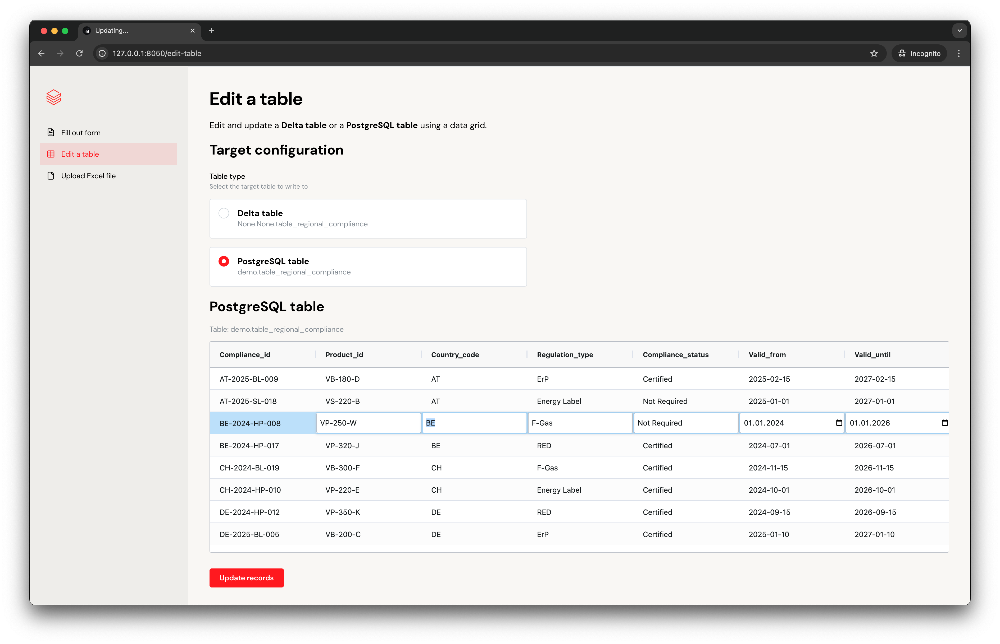

# Databricks Apps Writeback Example Application



## Overview

This example [Dash](https://dash.plotly.com/) application demonstrates **three writeback scenarios** from [Databricks Apps](https://www.databricks.com/product/databricks-apps) into [Unity Catalog](https://www.databricks.com/product/unity-catalog) tables and [Lakehouse](https://www.databricks.com/product/lakehouse) PostgreSQL tables.

### Features

1. **Form Data Collection** - Collect data through a form interface and write to a table
2. **Table Editing** - Modify existing tables using an editable grid component
3. **Excel Upload** - Replace table contents with data from uploaded Excel files

### Technologies used

- [Databricks SQL Connector for Python](https://docs.databricks.com/en/dev-tools/python-sql-connector.html) - Read and write Unity Catalog tables
- [SQLAlchemy Core](https://docs.sqlalchemy.org/en/20/core/) - Read and write Lakehouse PostgreSQL tables
- [Dash Mantine Components](https://www.dash-mantine-components.com/) - Modern UI styling
- [Dash AG Grid](https://dash.plotly.com/dash-ag-grid) - Interactive data grid component

## Prerequisites

- Python 3.11.0 or later
- [Databricks CLI](https://docs.databricks.com/en/dev-tools/cli/index.html) (latest version)
- [uv](https://docs.astral.sh/uv/) (latest version)
- Access to a [Lakehouse database instance](https://docs.databricks.com/en/lakehouse-platform/lakehouse/index.html) with `databricks_superuser` role
- Unity Catalog permissions:
  - Catalog and schema access
  - `CREATE TABLE` privilege on the schema
  - `USAGE` grant capability on catalog and schema
  - `SELECT` and `MODIFY` grant capability on tables

## Setup

### 1. Clone the repository

```bash
git clone https://github.com/databricks-solutions/databricks-apps-examples.git
cd databricks-apps-examples/apps-data-entry
```

### 2. Create a Databricks Apps resource

1. **Authenticate with Databricks:**

   ```bash
   databricks auth login --host <databricks-workspace-url>
   ```

1. Create a new Databricks Apps resource using either the CLI or UI:

   ```bash
   databricks apps create apps-write-back
   ```

   Wait 2-3 minutes for the app resource to reach `ACTIVE` state.

1. Note the `service_principal_client_id` from the output. You can also find it in the _Environment_ tab in the app UI as the `DATABRICKS_CLIENT_ID` environment variable (e.g., `58fe4a02-16f8-4547-ae6c-2978a3637a52`).

### 3. Database setup

This repository includes interactive setup scripts to seed Unity Catalog and PostgreSQL tables with example data.

**Set up Delta tables:**

```bash
uv run python setup/setup_delta_tables.py
```

**Set up PostgreSQL tables:**

```bash
uv run python setup/setup_postgres_tables.py
```

### 4. Configure app.yaml

Update the `app.yaml` file with your environment-specific configuration:

| Variable                | Example Value                                   | Where to Find It                              |
| ----------------------- | ----------------------------------------------- | --------------------------------------------- |
| `WAREHOUSE_HTTP_PATH`   | `/sql/1.0/warehouses/762f1d756f0424f6`          | SQL warehouse → _Connection details_ tab      |
| `UNITY_CATALOG_CATALOG` | `main`                                          | Same catalog used in database setup           |
| `UNITY_CATALOG_SCHEMA`  | `default`                                       | Same schema used in database setup            |
| `POSTGRES_HOST`         | `instance-111abc.database.cloud.databricks.com` | Lakehouse database → _Connection details_ tab |
| `POSTGRES_DATABASE`     | `databricks_postgres`                           | Same database used in database setup          |
| `POSTGRES_SCHEMA`       | `public`                                        | Same schema used in database setup            |

### 5. Deploy the application

Copy the app source code to your workspace files:

```bash
databricks sync . /Workspace/Users/user@example.com/databricks_apps/apps-write-back
```

Deploy the application:

```bash
databricks apps deploy apps-write-back --source-code-path /Workspace/Users/user@example.com/databricks_apps/apps-write-back
```

## Local development

To run the application locally for development:

1. **Authenticate with Databricks:**

   ```bash
   databricks auth login --host <databricks-workspace-url> --profile <my-profile>
   ```

2. **Start the application:**

   ```bash
   databricks apps run-local --prepare-environment --profile <my-profile>
   ```

   The `--prepare-environment` flag sets up a Python virtual environment and installs dependencies. Use this flag on first run or after dependency changes.

## Project Structure

```
apps-write-back/
├── src/
│   ├── app.py                # Main Dash application
│   ├── pages/                # Page components
│   │   ├── form.py           # Form data entry page
│   │   ├── table_edit.py     # Table editing page
│   │   └── excel_upload.py   # Excel upload page
│   ├── database_delta.py     # Unity Catalog operations
│   ├── database_postgres.py  # PostgreSQL operations
│   └── utilities.py          # Helper functions
├── setup/                    # Database setup scripts
├── app.yaml                  # Application configuration
└── requirements.txt          # Python dependencies
```
